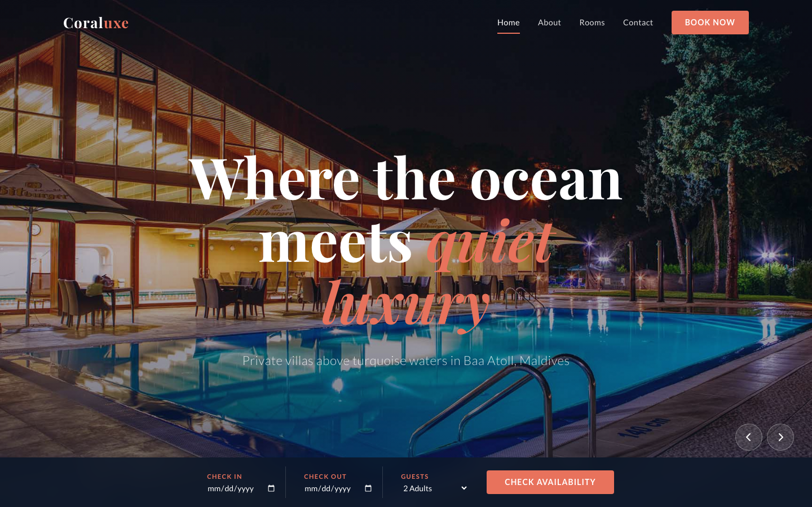

# Coraluxe Resort — HTML Template

**Coraluxe** is a luxury coral resort template for Baa Atoll, Maldives. Framework-free, premium design built with semantic HTML, custom CSS design tokens, and vanilla JavaScript. Every page tells the story of an ocean sanctuary where architecture dissolves into nature.

---

## 📸 Screenshot



## Live Pages

| Page | Description |
|------|-------------|
| [index.html](index.html) | Home — Hero with carousel, booking strip, room showcase, about split, gallery, testimonials, blog, CTA |
| [about.html](about.html) | About — Resort story, values grid, leadership section, CTA |
| [rooms.html](rooms.html) | Rooms — Room showcase cards, resort amenities grid, CTA |
| [contact.html](contact.html) | Contact — Info column (address, hours, phone, email), booking form with data-form validation, getting-here section, CTA |

---

## Design Distinction — 6-Axis Comparison

| Axis | Coraluxe | Sucré | Forge | Meridian | Chefer | Dentcare | Car Serv | Digital Agency |
|------|----------|-------|-------|----------|--------|----------|----------|----------------|
| **Domain** | Luxury coral resort | Patisserie / bakery | Industrial / manufacturing | Hospitality group | Dental clinic | Dental clinic | Automotive service | Tech / digital |
| **Palette** | Deep ocean navy + coral + seafoam + sand gold | Pastel pink + cream + blush | Steel gray + rust orange + black | Teal + charcoal + ivory | Clinical white + sky blue + mint | White + teal + soft green | Charcoal + red + silver | Dark navy + electric blue + white |
| **Typography** | Playfair Display + Lato + Libre Baskerville | Playfair Display + Inter | Oswald + Source Sans | Cormorant Garamond + Raleway | Poppins + Open Sans | DM Sans + Inter | Montserrat + Roboto | Space Grotesk + Inter |
| **Mood** | Serene ocean luxury, coral reef reverence | Sweet indulgence, artisanal warmth | Raw power, precision engineering | Refined global hospitality | Clean clinical trust | Modern wellness, approachable care | Speed, reliability, craftsmanship | Innovation, futuristic energy |
| **Layout Style** | Horizontal room scroll + masonry gallery + booking strip | Menu grid + featured specials + Instagram feed | Project portfolio + timeline + stats | Multi-property showcase + dining + events | Before/after gallery + services grid + booking | Service cards + testimonial carousel + online booking | Service packages + vehicle gallery + quote form | Case studies + team grid + animated hero |
| **Interactive Layer** | Carousel slides, scroll-snap rooms, fade-up reveals | Parallax menu, hover recipe cards | Animated counters, heavy transitions | Property switcher, dining menu tabs | Image slider, procedure accordions | Interactive smile gallery, booking wizard | Vehicle selector, service estimator | Scroll-triggered animations, particle effects |

---

## Features

- **Zero dependencies** — No React, Tailwind, Bootstrap, or build tools. Pure HTML, CSS, and vanilla JS.
- **Design token system** — All colors, spacing, typography, shadows, and transitions defined as CSS custom properties in `:root`.
- **Semantic HTML5** — ARIA labels, roles, and landmarks for accessibility.
- **Responsive by default** — Fluid typography with `clamp()`, CSS Grid auto-fit, and three breakpoints (1024px, 768px, 480px).
- **Smooth animations** — Intersection Observer-powered fade-up reveals, CSS transitions for hover states, and carousel slide effects.
- **Original imagery** — All 17 images are original resort photography (no stock placeholders).
- **Booking integration ready** — Hero booking strip with date/guest selectors, contact form with `data-form` attribute for JS validation.
- **Mobile-first nav** — Full-screen overlay menu with animated hamburger toggle.
- **Back-to-top** — Fixed scroll-to-top button with visibility toggle.
- **Newsletter input** — Footer newsletter signup with email input.

---

## File Structure

```
coral-resort-html-template/
├── index.html              # Home page
├── about.html              # About / story page
├── rooms.html              # Rooms & villas showcase
├── contact.html            # Contact & booking form
├── README.md               # This file
├── assets/
│   ├── css/
│   │   └── base.css        # Full design system (tokens + components + responsive)
│   ├── js/
│   │   └── main.js         # Carousel, nav toggle, scroll animations, form handling
│   └── img/
│       ├── about.jpg
│       ├── blog-1.jpg
│       ├── blog-2.jpg
│       ├── blog-3.jpg
│       ├── carousel-1.jpg
│       ├── carousel-2.jpg
│       ├── feature.jpg
│       ├── gallery-sm-1.jpg
│       ├── gallery-sm-2.jpg
│       ├── gallery-sm-3.jpg
│       ├── gallery-sm-4.jpg
│       ├── gallery-sm-5.jpg
│       ├── gallery-sm-6.jpg
│       ├── room-1.jpg
│       ├── room-2.jpg
│       ├── room-3.jpg
│       └── signature.jpg
```

---

## Design Tokens

The entire visual language is controlled through CSS custom properties:

| Token | Value | Usage |
|-------|-------|-------|
| `--deep-ocean` | `#0A1628` | Primary dark, nav, footer, overlays |
| `--coral` | `#E8725C` | Accent, CTAs, highlights, badges |
| `--seafoam` | `#7ECAC1` | Secondary accent, amenity icons |
| `--sand` | `#F5EDE3` | Section backgrounds, warmth |
| `--gold` | `#C9A96E` | Premium badges, star ratings |
| `--font-display` | Playfair Display | Headings, titles, brand |
| `--font-body` | Lato | Body text, UI elements |
| `--font-quote` | Libre Baskerville | Blockquotes, testimonials |

---

## Getting Started

1. Open `index.html` in any modern browser.
2. No server required — all pages work as static files.
3. For local development with live reload, use any static file server (e.g., `npx serve .`).

---

## Let's Build Something Together

This template was designed and built with care. If you have a project that deserves this level of craft, let's talk.

**[Start a project with us](https://tally.so/r/q4q1L9)**
